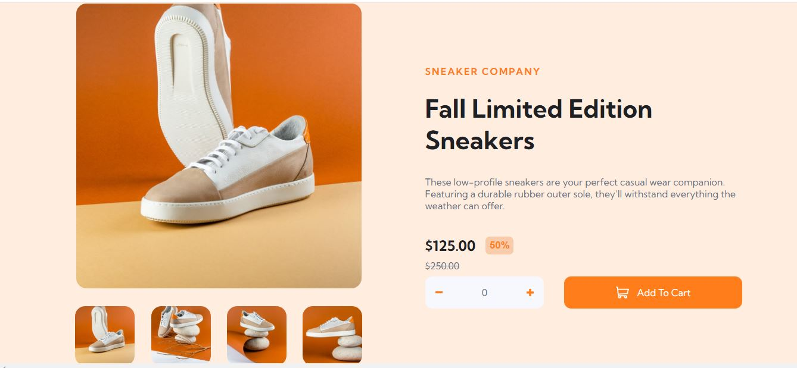

# Frontend Mentor - E-commerce product page solution

This is a solution to the [E-commerce product page challenge on Frontend Mentor](https://www.frontendmentor.io/challenges/ecommerce-product-page-UPsZ9MJp6).

## Table of contents

- [Frontend Mentor - E-commerce product page solution](#frontend-mentor---e-commerce-product-page-solution)
  - [Table of contents](#table-of-contents)
    - [The challenge](#the-challenge)
    - [Screenshot](#screenshot)
    - [Links](#links)
  - [My process](#my-process)
    - [Built with](#built-with)
    - [What I learned](#what-i-learned)
  - [Author](#author)
  - [Acknowledgments](#acknowledgments)


### The challenge

Users should be able to:

- View the optimal layout for the site depending on their device's screen size
- See hover states for all interactive elements on the page
- Switch the large product image by clicking on the small thumbnail images
- Add items to the cart
- View the cart and remove items from it

### Screenshot



### Links

- [Solution URL](https://github.com/Aahil13/Ecommerce-page)
- [Live Site URL](https://aahil13.github.io/Ecommerce-page/#)

## My process

### Built with

- Semantic HTML5 markup
- Flexbox
- CSS Variables
- JavaScript


### What I learned

```css
:root {
  --main-bg-color: hsl(25, 100%, 94%);
  --main-p-color: hsl(219, 9%, 45%);
  --orange-color: hsl(26, 100%, 55%);
  --dark-blue-color: hsl(220, 13%, 13%);
}
```
```js
const goToSlide = function (slide) {
    slides.forEach(
      (s, i) => (s.style.transform = `translateX(${100 * (i - slide)}%)`)
    );
  };
```

## Author

- Frontend Mentor - [@Aahil13](https://www.frontendmentor.io/profile/Aahil13)
- Twitter - [@OnyeanunaE](https://www.twitter.com/OnyeanunaE)


## Acknowledgments

- Frontend Mentor
